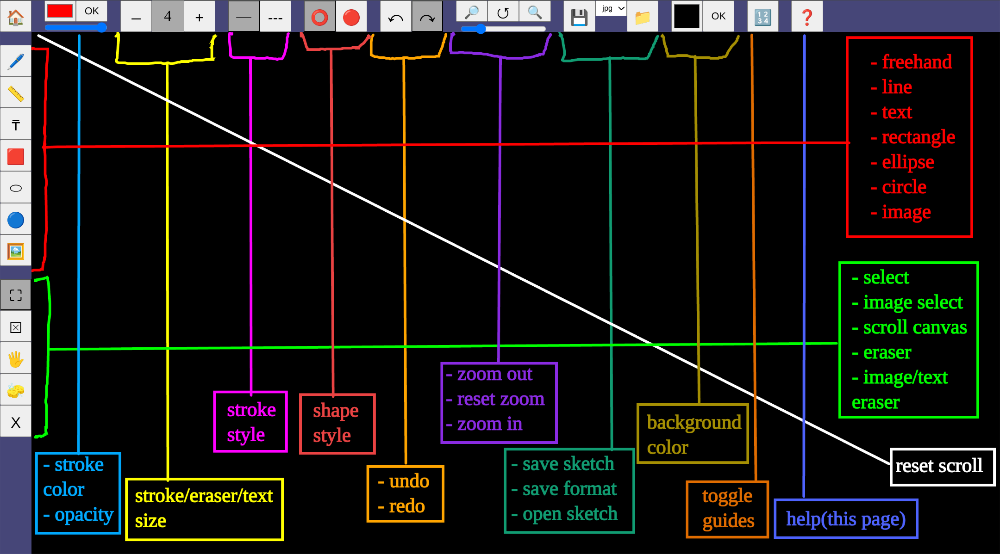

# Not_E

Not_E (pronounced "naughty") is a simple, lightweight drawing app.

It is designed specifically with pen tablet users in mind.

Most web-based drawing apps lack keyboard shortcuts and require cumbersome interactions like moving to different areas of the screen to switch between colors or to use the eraser, this can be a pain for people using pen tablets.

Not_E implements clean, user-friendly keyboard shortcuts, all present on the left hand side of the keyboard, so you can keep drawing with both hands. 🫲😁🫱

You can use it online here : https://nishchal-bhat.github.io/Not_E/

Or download the [Not_E.html](./Not_E.html) file. 
This is a standalone file that you can open in your browser and use like any other application

---
## Features
- Supports drawing and erasing with the stylus
- Also lets you add text and images
- Keyboard shortcuts for all essential actions
- Undo/redo for easy corrections
- You can save your canvas in either a .jpg or .json format.  
Choosing .jpg will save an image of your entire canvas. 
Choosing .json will create a save file on your device. This save file can be loaded up subsequently.

The app also has a few ~~bugs~~...~~features~~...quirks 🤭. Please read [Instructions](https://github.com/Nishchal-Bhat/pages/tree/main?tab=readme-ov-file#instructions)

---
## Keyboard Shortcuts : 
|key|action|
|-|-|
|`|switch to white|
|1|switch to red|
|2|switch to green|
|3|switch to blue|
|4|switch to yellow|
|5|switch to black|
|q|__decrease stroke, eraser, text size__ **|
|w|increase stroke, eraser, text size|
|e|toggle between 'solid' and 'dashed' strokes|
|a|line mode|
|s|freehand mode|
|d|text mode|
|f|__eraser mode__ **|
|z|undo|
|x|redo|

### ** __NOTE__ : 
- You can also use button 1 (or whichever is mapped to right click) on the stylus to activate the eraser without having to switch to eraser mode.

- q and w control the size of:
  - the stroke when in line or freehand mode
  - the eraser when in eraser mode
  - the text when in text mode

---
## The GUI

---
## Instructions

- When erasing with the stylus button held down, it is advised to hover over the tablet instead of pressing down. Depending on how your tablet registers clicks, releasing the stylus button while pressed down on the tablet may unintentionally trigger a new stroke. This behavior is entirely dependent on how your tablet handles input events and cannot be resolved through code(at least not in a browser environment). 
This issue does not occur when erasing in eraser mode, as it does not require holding down the stylus button.

- When drawing in freehand mode, the app may slightly flatten some curved strokes. This is due to an optimization algorithm designed to reduce the number of points in each stroke. To minimize this effect, try drawing the curve more slowly; this should help prevent the algorithm from flattening it.

- Once drawn, entities (lines, text, etc.) cannot be selected, moved, recolored, or in any way modified. You can only erase them.

- In text mode, there is no cursor you can move to select or edit different characters of the text, you will have to erase and retype typos
